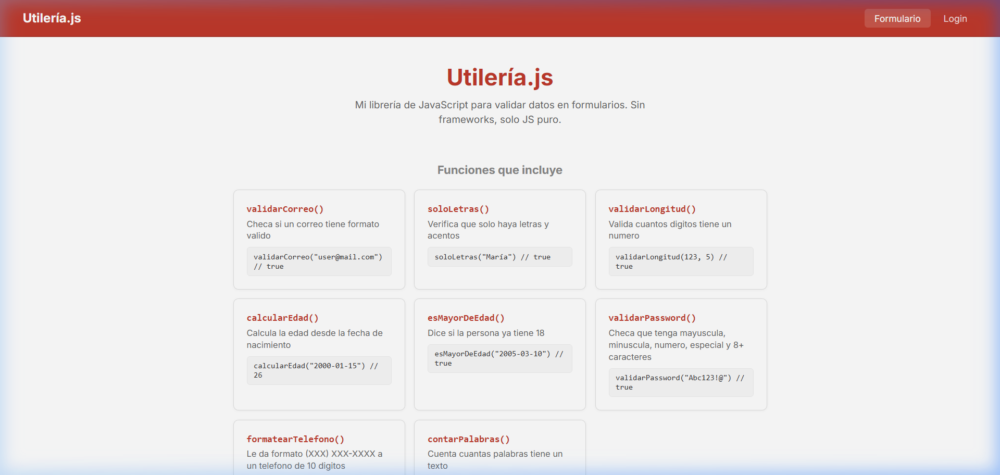
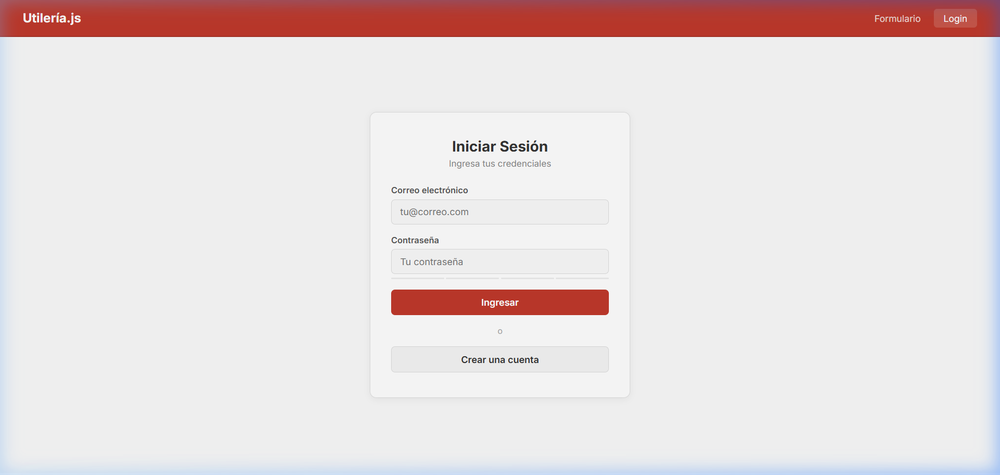

# Utilería.js

Librería de JavaScript puro para validar datos en formularios web. La hice sin usar ningún framework, es solo JavaScript vanilla que se puede usar en cualquier proyecto HTML.

## Qué problema resuelve

Cuando haces formularios siempre tienes que estar validando lo mismo: que el correo esté bien, que la contraseña sea segura, que el nombre no tenga números, etc. Esta librería tiene funciones ya hechas para todo eso y las puedes reutilizar.

## Instalación

Solo hay que agregar el script en tu HTML:

```html
<script src="js/utileria.js"></script>
```

No necesitas instalar nada más.

## Funciones

### validarCorreo(correo)
Regresa `true` si el correo tiene formato válido.

```javascript
validarCorreo("usuario@gmail.com")   // true
validarCorreo("correo-sin-arroba")   // false
validarCorreo("otro@dominio.co.mx")  // true
```

### soloLetras(texto)
Checa que el texto solo tenga letras (acepta acentos, ñ y espacios).

```javascript
soloLetras("María José")      // true
soloLetras("Juan123")          // false
soloLetras("José Ángel Ñoño") // true
```

### validarLongitud(numero, maxLongitud)
Valida que un número no pase de cierta cantidad de dígitos.

```javascript
validarLongitud(12345, 5)    // true
validarLongitud(123456, 5)   // false
validarLongitud(99, 10)      // true
```

### calcularEdad(fechaNacimiento)
Calcula cuántos años tiene alguien. La fecha va en formato `"YYYY-MM-DD"`.

```javascript
calcularEdad("2000-01-15")   // 26
calcularEdad("1990-12-25")   // 35
```

### esMayorDeEdad(fechaNacimiento)
Dice si la persona ya tiene 18 años o más.

```javascript
esMayorDeEdad("2005-03-10")  // true
esMayorDeEdad("2010-01-01")  // false
```

### validarPassword(password)
Checa que la contraseña tenga:
- Mínimo 8 caracteres
- Al menos 1 mayúscula
- Al menos 1 minúscula
- Al menos 1 número
- Al menos 1 carácter especial

```javascript
validarPassword("Abc12345!")   // true
validarPassword("abc12345")    // false
validarPassword("Abcd!")       // false
```

### formatearTelefono(telefono)
Le da formato bonito a un teléfono de 10 dígitos. Si no son 10, regresa `null`.

```javascript
formatearTelefono("5551234567")   // "(555) 123-4567"
formatearTelefono("123")          // null
```

### contarPalabras(texto)
Cuenta las palabras en un texto.

```javascript
contarPalabras("Hola mundo")           // 2
contarPalabras("  Uno   dos   tres ")  // 3
contarPalabras("")                     // 0
```

## Donde se usa

- **index.html** - Tiene un formulario de registro que usa todas las funciones para validar en tiempo real. También abre un modal con la edad calculada.
- **login.html** - Página de login que usa `validarCorreo` y `validarPassword`.

## Estructura

```
/utileria
├── README.md
├── index.html
├── login.html
├── css/
│   └── styles.css
├── js/
│   └── utileria.js
└── img/
```

## Capturas de pantalla




## Autor

Manuel Matias - 2026
